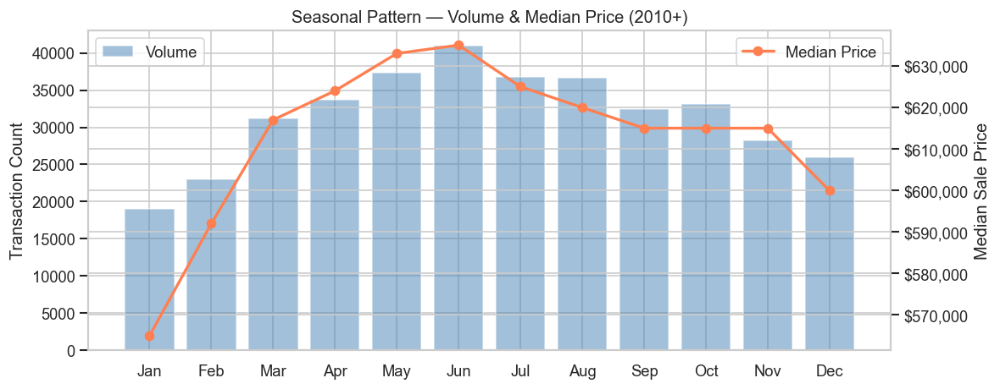
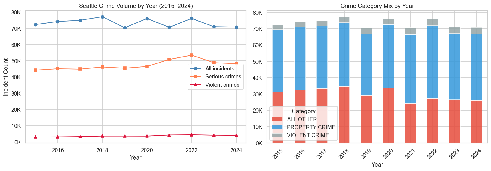

# Seattle Housing Analytics

Exploratory analysis of King County residential real estate — combining public assessor records, school quality data, crime incidents, and GIS boundaries to understand what drives housing prices. Full methodology and findings are documented across three companion reports: [`data_acquisition.md`](data_acquisition.md), [`data_foundation.md`](data_foundation.md), and [`market_intelligence.md`](market_intelligence.md).

---

## Notebooks

| Notebook | Description |
|----------|-------------|
| [`kc_housing_eda.ipynb`](kc_housing_eda.ipynb) | EDA across all four KC Assessor datasets: price trends, structural features, waterfront premiums, and feature engineering |
| [`kc_schools_housing.ipynb`](kc_schools_housing.ipynb) | School quality analysis: OSPI pass rates, GIS spatial join (parcel → school district), school premium quantification |
| [`kc_crime_housing.ipynb`](https://nbviewer.org/github/yijiaw0725/seattle-housing-analytics/blob/main/kc_crime_housing.ipynb) | Crime & housing: SPD 2015–2024 trends, neighborhood heatmap, spatio-temporal BallTree scoring *(nbviewer)* |
| [`kc_buyer_guide.ipynb`](https://nbviewer.org/github/yijiaw0725/seattle-housing-analytics/blob/main/kc_buyer_guide.ipynb) | Buyer guide: choropleth maps, value score ranking, budget cheat sheet, view/waterfront premiums *(nbviewer)* |
| [`kc_price_model.ipynb`](kc_price_model.ipynb) | Hedonic pricing models: OLS baseline + XGBoost (KC-wide and Seattle-only), SHAP feature importance |

---

## 1. Data Acquisition

Full details in [`data_acquisition.md`](data_acquisition.md). Five public datasets were combined:

| Dataset | Source | Period | Method | Records |
|---------|--------|--------|--------|---------|
| KC Assessor — Property Sales | [KC Assessor Portal](https://info.kingcounty.gov/assessor/datadownload/default.aspx) | 2015–2024 | Form scraping + stream download | 2.4M raw → 271,923 SFR sales |
| KC Assessor — Building & Parcel | Same | Full history | Same | 532K buildings, 627K parcels |
| SPD Crime Incidents | [data.seattle.gov](https://data.seattle.gov/Public-Safety/SPD-Crime-Data-2008-Present/tazs-3rd5) | 2015–2024 | Socrata JSON API (paginated) | 733,596 incidents |
| WA OSPI School Assessments | [data.wa.gov](https://data.wa.gov/education/Report-Card-Assessment-Data-2023-24-School-Year/x73g-mrqp) | 2023–24 | Socrata JSON API | King County K–12 public schools |
| KC GIS — School Districts & Parcels | [KC GIS MapServer](https://gisdata.kingcounty.gov) | Current | ArcGIS REST API | 20 district polygons, 669K parcel coordinates |

**SFR filter applied to all housing analysis:** `SaleReason=1` (arms-length) · `PropertyClass=8` (residential with building) · `SalePrice > $10K` · `NbrLivingUnits=1` · `SqFtTotLiving` 200–15,000 sq ft · `YrBuilt` 1870–2024

---

## 2. Exploratory Data Analysis

Full findings with charts in [`data_foundation.md`](data_foundation.md).

### Housing Prices — King County, 2015–2024


Median SFR price grew from ~$150K (1990) to a peak near $900K (2022), with two distinct run-ups: post-crisis recovery (2012–2018) and a COVID-era surge (2020–2022), followed by a modest correction in 2023–2024. Living area (r = 0.52) and building grade (r = 0.51) are the strongest predictors; waterfront properties command a **+76.9%** median premium over non-waterfront.



Transaction volume peaks in May–June. Median price follows — roughly **$630K** in summer vs. **$575K** in January (~10% seasonal swing).

---

### School Quality — All 20 King County Districts, 2023–24


OSPI composite pass rate and median district home price are tightly correlated (r = 0.77). The top-performing districts — Mercer Island, Lake Washington, Bellevue, Issaquah — score above 70% across Math, ELA, and Science and sit at the upper right. Mercer Island is both the highest-scoring and most expensive.


Top-quartile school districts have a median sale price of **$1,015K** vs. **$511K** for the bottom quartile — a raw premium of **+99%**. Note: these are uncontrolled comparisons; the modeled marginal effect is lower (see Section 3).

---

### Crime — Seattle City Limits, 2015–2024



Serious crime peaked in 2022 (+9% vs. 2015) before declining slightly; violent crime rose +45% over the decade. Property crime consistently accounts for ~half of all incidents.


The raw price gap between the safest and highest-crime quintile is only **−1.1%** ($820K vs. $805K). Price per sq ft tells the opposite story — it *rises* from $429 (safest) to $564 (highest crime). High-crime areas in Seattle are dense urban neighborhoods where land value masks any crime discount.

---

## 3. Buyer Guide & Price Model

Full analysis in [`market_intelligence.md`](market_intelligence.md).

### What Each School District Actually Costs


Typical 3-bedroom home prices range from ~$600K (Auburn) to over $2M (Mercer Island). Bar color encodes school quality — darker green means higher OSPI pass rate.


Moving from the bottom 25% to the top 25% of school districts costs an extra **+112%** in median price ($612K → $1.3M, 2020–2024). Home size increases modestly (1,660 → 2,240 sq ft); most of the premium is in land and location.

### Where School Quality Meets Value


The value score divides each district's OSPI composite pass rate by median price per $100K — higher means more school quality per dollar. Tahoma, Shoreline, and Enumclaw rank at the top. Mercer Island and Bellevue rank near the bottom: excellent schools, but the premium is already fully priced in.

---

### What Actually Drives Prices — Model Results

Three models were trained on 2015–2021 data and tested on 2022–2024 (temporal split):

| Model | R² | Median APE |
|-------|----|------------|
| OLS (Full KC) | 0.640 | 17.0% |
| XGBoost (Full KC) | 0.698 | 16.6% |
| XGBoost (Seattle-only, +crime) | 0.678 | 15.0% |


**SaleYear** is the single largest driver (SHAP = 0.25) — when you buy matters more than any feature of the home. **School quality** (pct_composite, SHAP = 0.20) ranks second, ahead of building grade (0.14) and living area (0.09). After controlling for size, grade, and location, moving from a 30% to an 80% school composite pass rate adds roughly **+$150K–$200K** to predicted price. Crime has a real but limited effect — at the extreme end of Seattle exposure, the modeled penalty is approximately **−$50K–$100K**.

---

## Project Structure

```
seattle-housing-analytics/
├── kc_housing_eda.ipynb              # KC Assessor EDA
├── kc_schools_housing.ipynb          # School quality + GIS spatial join
├── kc_crime_housing.ipynb            # SPD crime trends + BallTree scoring
├── kc_buyer_guide.ipynb              # District guide: maps, value scores, budget
├── kc_price_model.ipynb              # OLS + XGBoost hedonic pricing models
├── data_acquisition.md               # Data sources, download methods, filters
├── data_foundation.md                # EDA methodology and key findings
├── market_intelligence.md            # Buyer guide + price model analysis
├── assets/                           # Chart PNGs for reports and README
├── education_data/
│   ├── ospi_assessment_2324_king.csv # OSPI school pass rates
│   ├── kc_school_districts.geojson   # School district boundary polygons
│   ├── kc_parcel_coords.csv          # 669K parcel lat/lon coordinates
│   └── kc_pin_district_lookup.csv    # PIN → school district lookup
├── crime_data/
│   └── seattle_sales_crime_score.csv # PIN → crime exposure score (derived)
└── scripts/
    ├── download_kc_assessor_data.py  # Downloads KC Assessor zip files
    └── dataset_verification.py       # Validates field names & distributions
```

---

## Quickstart

```bash
# 1. Create and activate virtual environment
uv venv && source .venv/bin/activate

# 2. Install dependencies
uv pip install pandas numpy matplotlib seaborn jupyter geopandas requests xgboost shap

# 3. Download KC Assessor data (requires accepting terms — handled automatically)
python scripts/download_kc_assessor_data.py

# 4. Verify data integrity
python scripts/dataset_verification.py

# 5. Launch notebooks
jupyter notebook
```

> Education data (`education_data/`) is already committed — no separate download needed.
> Crime raw data (`spd_crime_2015_2024.csv`, 100MB) is gitignored — re-download by running `kc_crime_housing.ipynb`.
