# Market Intelligence
### Buyer's District Guide & Price Driver Analysis — King County Housing

This document presents two applied studies built on the data described in [`data_foundation.md`](data_foundation.md). Part 1 is a practical district-by-district guide for buyers. Part 2 breaks down what actually drives home prices using statistical models.

---

## Part 1 — The Buyer's District Guide

**Source:** `kc_buyer_guide.ipynb` · KC Assessor, WA OSPI (Washington Office of Superintendent of Public Instruction — the state agency that publishes standardized test results for all public schools), KC GIS, SPD

**Scope:** King County, WA — all 20 public school districts · 2020–2024 sales · 2023–24 school year

**What this section does:** Rather than asking "which neighborhood is cheapest?", this guide asks a better question — which districts offer the most school quality per dollar? It ranks every district on both price and school quality, then combines them into a single value score so buyers can compare like-for-like across very different markets.

```python
# kc_buyer_guide.ipynb — arms-length SFR sales, 2020–2024
sales_clean = (
    rp[(rp['SaleReason']==1) & (rp['SalePrice']>10_000) & (rp['PropertyClass']==8) &
       (rp['SaleYear'].between(2020,2024))]
    .merge(rb_sfr, on='PIN', how='inner')
)
sales_d = sales_clean.merge(pin_district, on='PIN', how='left')  # attach school district via spatial lookup
```

---

**District price rankings**

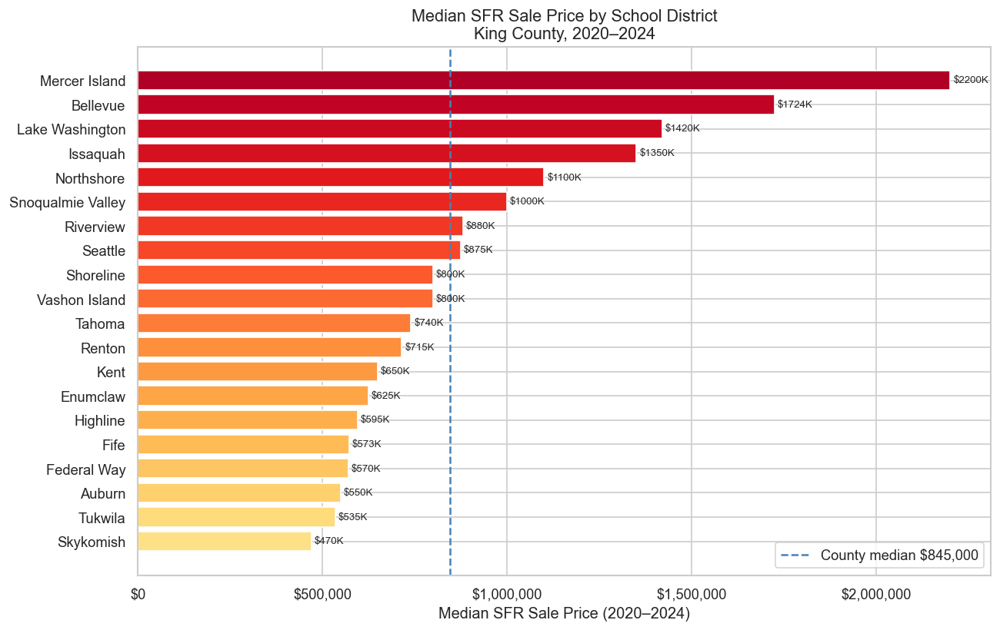

Median SFR prices range from under $600K (Auburn, Skykomish) to over $2M (Mercer Island). The county median sits at $845K (dashed line). Mercer Island, Bellevue, and Lake Washington cluster at the top — all have both high prices and high school pass rates. Most districts in the $700K–$1.1M range represent mid-tier markets with meaningful variation in school quality.

---

**School quality vs. price per square foot**

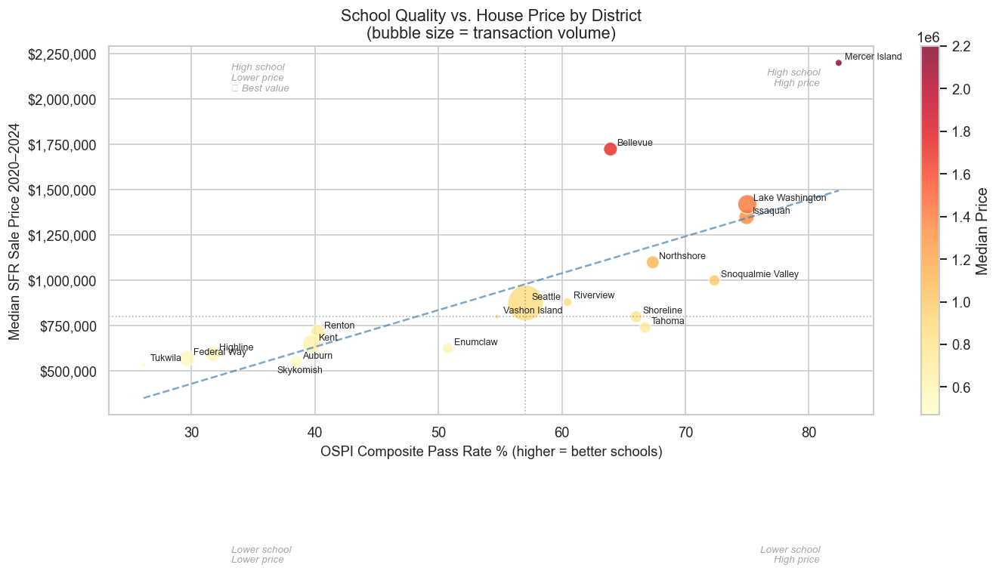

Each bubble represents one district; bubble size reflects transaction volume. The upward trend confirms that districts with higher OSPI composite pass rates command higher median sale prices. Mercer Island anchors the top right — the highest-scoring and most expensive. Tukwila and Federal Way sit in the lower left, offering lower prices with lower school pass rates. A handful of mid-range districts (Snoqualmie Valley, Northshore) sit above the trend line, signaling relatively better value for their school performance.

---

**What school quality level actually costs**

```python
with_scores['school_quartile'] = pd.qcut(
    with_scores['pct_composite'].fillna(with_scores['pct_composite'].median()),
    q=4, labels=['Q1\nBottom 25%','Q2','Q3','Q4\nTop 25%']
)
```

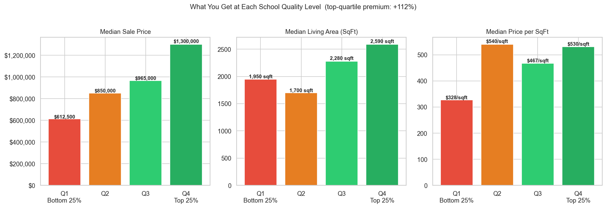

Moving from the bottom 25% of districts (Q1) to the top 25% (Q4) costs an extra **+112%** in median sale price — from $612K to $1.3M. The gap in home size is more modest: Q1 median is 1,660 sq ft vs. Q4 at 2,240 sq ft. Most of the premium is in the land and location, not the structure itself. Price per sq ft rises from $370 (Q1) to $570 (Q4), meaning buyers in top-quartile districts are paying more for every square foot, not just getting larger homes.

---

**Value score — school quality per dollar**

```python
master['value_score'] = master['pct_composite'] / (master['median_price'] / 100_000)
```

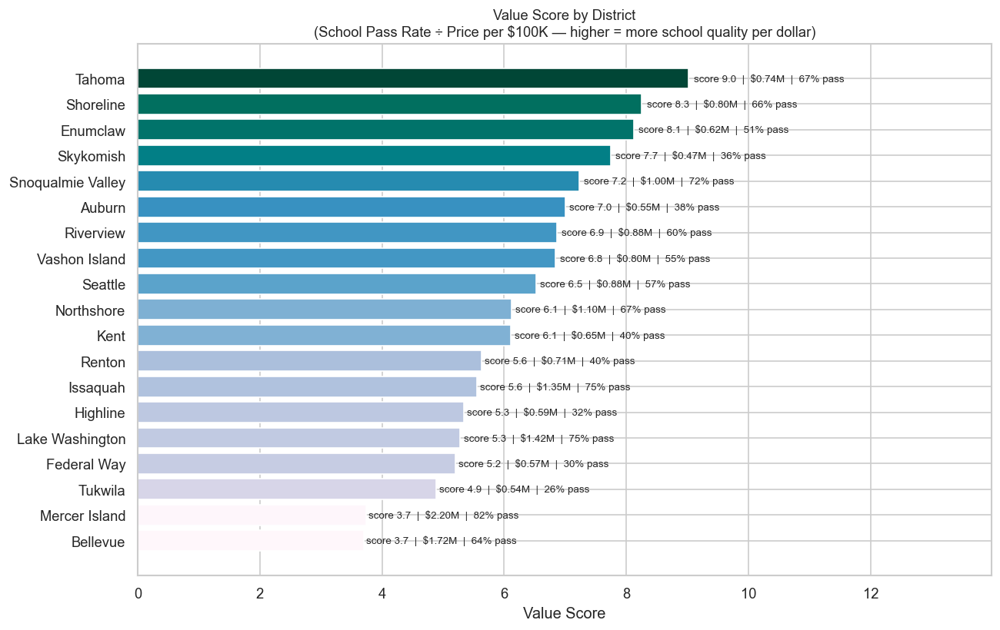

The value score divides the OSPI composite pass rate by median price per $100K. A higher score means more school quality per dollar spent. Tahoma, Shoreline, and Enumclaw rank at the top — solid school performance at moderate prices. Mercer Island and Bellevue, despite their excellent schools, score near the bottom because the price premium is so steep. For budget-conscious buyers who still prioritize schools, the sweet spot lies in mid-range districts like Snoqualmie Valley, Issaquah, and Northshore.

---

**The 3-bedroom market by district**

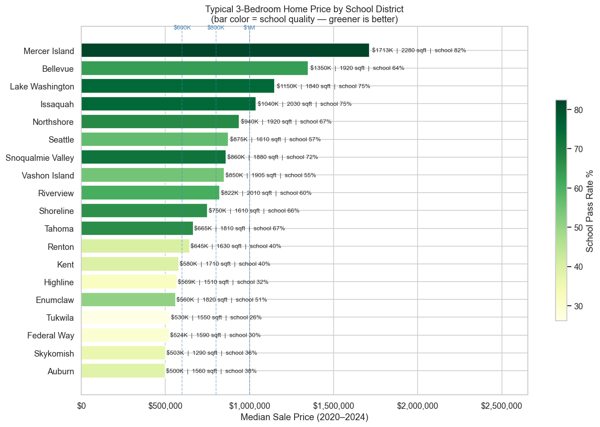

For buyers targeting a 3-bedroom home — the most common configuration — median prices range from ~$600K (Auburn) to over $2M (Mercer Island). Bar color encodes school quality (darker green = higher pass rate). The chart shows that some high-priced districts (Bellevue, Lake Washington) also deliver strong school performance, while others in a similar price range fall behind. Auburn and Tukwila stand out as the most affordable entry points with 3-bedroom homes, though with lower school pass rates.

---

**What your budget actually buys**

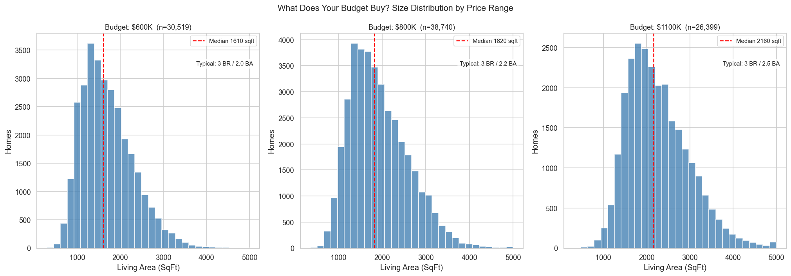

At **$600K** (n=30,519 transactions): typical 3BR/2.5BA, median 1,610 sq ft. At **$800K** (n=38,740): typical 3BR/2.5BA, median 1,920 sq ft. At **$1.1M** (n=26,398): typical 3BR/2.5BA, median 2,160 sq ft. The size distributions show wide spread at every price point — meaning location and school district, not just budget, determine what you actually get. Two buyers spending $800K can end up with homes 800 sq ft apart depending on district.

---

**View and waterfront premiums**

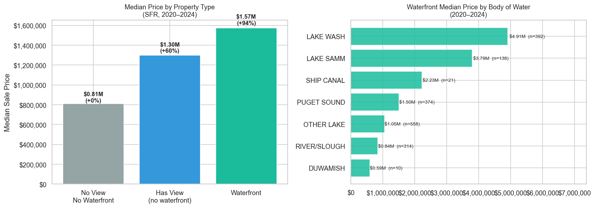

Relative to a standard home with no view and no waterfront access ($810K median), having any view — but no water frontage — adds **+68%** ($1.36M median). Full waterfront access pushes the median to **$1.57M (+94%)**. The right panel breaks waterfront prices by body of water: Lake Washington commands the highest premium (~$3.7M median), followed by Lake Sammamish (~$2.8M) and Ship Canal (~$2.4M). Puget Sound waterfront is notably lower (~$1.6M), reflecting different neighborhood contexts along the Sound shoreline. These are raw comparisons — waterfront homes also tend to be larger and better-graded, so the premium attributable to water access alone is somewhat lower.

---

**Summary**

The central finding of the buyer's guide is that **price and school quality do not always move together**. Mercer Island and Bellevue are the most expensive districts and the best-scoring — but buyers pay a steep premium for that combination, leaving little value on the table. The most interesting districts are those where school quality is solid but price has not fully caught up: Snoqualmie Valley, Northshore, and Issaquah consistently sit above the trend line in the school-quality-vs-price chart. For buyers on a tighter budget, Auburn and Tukwila offer the lowest 3-bedroom entry points in the county, though with correspondingly lower school pass rates. The budget analysis also shows that the same dollar buys very different square footage depending on district — two buyers spending $800K can end up with homes nearly 800 sq ft apart.

---

## Part 2 — What Drives Home Prices: The Model

**Source:** `kc_price_model.ipynb` · KC Assessor, WA OSPI, SPD (via `kc_buyer_guide.ipynb` merged dataset)

**Scope:** Full King County for structural/school/time features · Seattle only for crime features · 2015–2024

**Why model?** The EDA findings in `data_foundation.md` show strong raw correlations — but raw comparisons cannot isolate any single factor. A waterfront home is also larger, newer, and in a better school district. A model controls for all these factors simultaneously, so we can ask: holding size, grade, and location constant, how much is school quality actually worth?

**Target variable — log(SalePrice):** Raw sale price is right-skewed (a few $3M+ homes distort the distribution). Taking the log produces an approximately normal distribution, satisfying OLS's assumption of normally distributed residuals with stable variance. It also gives coefficients a more natural interpretation: each unit change in a predictor corresponds to a percentage change in price, rather than a fixed dollar amount — more consistent with how housing markets actually work. XGBoost has no normality assumption, but using the same log target keeps all three models directly comparable.

**Three models, one shared setup:**

| | OLS | XGBoost (Full KC) | XGBoost (Seattle-only) |
|---|---|---|---|
| Purpose | Interpretable baseline; coefficients read directly as % price effects | Main model; captures non-linear relationships (e.g. BldgGrade's steep upper-grade premium) | Adds crime exposure, which only exists for Seattle properties |
| Geography | King County | King County | Seattle city limits |
| Period | 2015–2024 | 2015–2024 | 2015–2024 |
| Train / Test | 2015–2021 / 2022–2024 | 2015–2021 / 2022–2024 | 2015–2021 / 2022–2024 |
| Key assumption | Linear relationship between predictors and log(price); residuals approximately normal and homoskedastic — log transform addresses this | No distributional assumptions; requires enough data to avoid overfitting — addressed by early stopping and regularization | Same as Full KC |
| Crime feature | — | Excluded (sparse outside Seattle) | crime_count_500m ✓ |

All three models share the same predictors otherwise: structural features (SqFtTotLiving, BldgGrade, Condition, Bedrooms, TotalBaths, EffectiveAge, IsRenovated, BasementRatio, Stories, LogSqFtLot), location features (IsWaterfront, WfntFootage, ViewScore, HasNuisance), school quality (pct_composite), and time (SaleYear, SaleMonth). The temporal train/test split — training on 2015–2021, testing on 2022–2024 — ensures no future price information leaks into model training.

**Target variable and feature engineering**

```python
sales['LogSalePrice'] = np.log(sales['SalePrice'])                                      # log transform
sales['EffectiveAge'] = sales['SaleYear'] - sales[['YrBuilt','YrRenovated']].max(axis=1) # age resets if renovated
sales['ViewScore']    = sales[VIEW_COLS].clip(upper=1).sum(axis=1)                        # sum of 10 view columns
sales['BasementRatio']= sales['SqFtFinBasement'] / sales['SqFtTotLiving']                # finished basement share
sales['HasNuisance']  = ((sales['PowerLines']==1) | (sales['TrafficNoise']>0)).astype(int)
```

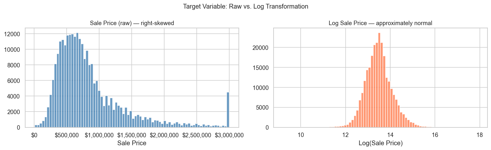

Raw SalePrice is right-skewed — a few $3M+ homes pull the distribution far to the right. The log transform produces an approximately normal distribution, satisfying OLS's residual assumptions. All model outputs are predicted in log space and exponentiated back to dollars for evaluation.

---

**Feature distributions**

```python
FEATURES_STRUCTURAL   = ['SqFtTotLiving','BldgGrade','Condition','Bedrooms','TotalBaths',
                          'EffectiveAge','IsRenovated','BasementRatio','Stories','LogSqFtLot']
FEATURES_LOCATION     = ['IsWaterfront','WfntFootage','ViewScore','HasNuisance']
FEATURES_NEIGHBORHOOD = ['pct_composite', 'crime_count_500m']  # school quality + crime (Seattle only)
FEATURES_TEMPORAL     = ['SaleYear','SaleMonth']
```

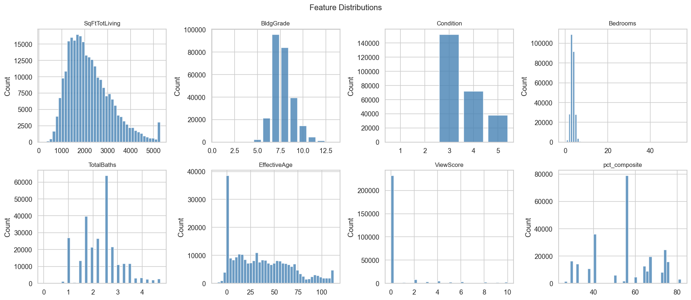

Living area peaks around 1,500–2,000 sq ft; BldgGrade concentrates at Grade 7 (Average); Bedrooms and Condition both peak at 3. EffectiveAge spreads broadly from new construction to 100+ years. ViewScore and school composite (pct_composite) are right-skewed — most properties have no view and sit in mid-range school districts.

---

**Univariate signal strength**

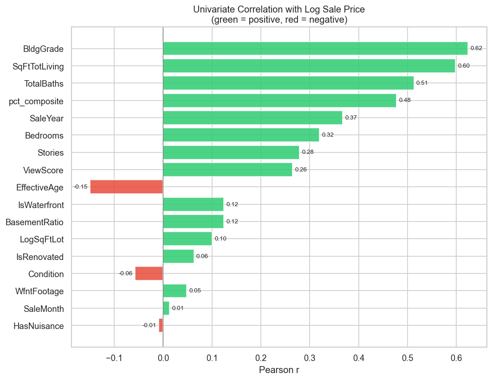

Building grade (r ≈ 0.60) and living area (r ≈ 0.55) have the strongest individual correlations with log price. School composite (r ≈ 0.44) ranks ahead of sale year (r ≈ 0.41) and bedrooms (r ≈ 0.38). Waterfront footage (r ≈ 0.46) is also notable. Effective age is the main negative signal (r ≈ −0.16). These are raw single-variable correlations; the model accounts for all jointly.

---

**Model training**

```python
# Temporal split — 2015–2021 train, 2022–2024 test (no future data leaks into training)
train_mask = model_df['SaleYear'] <= 2021   # 181,739 rows
test_mask  = model_df['SaleYear'] >= 2022   #  60,814 rows

xgb_kc = xgb.XGBRegressor(
    n_estimators=1000, max_depth=6, learning_rate=0.05,
    subsample=0.8, colsample_bytree=0.8, early_stopping_rounds=20
)
xgb_kc.fit(X_train, y_train, eval_set=[(X_val, y_val)], verbose=False)
```

---

**Model performance**

Three models were evaluated on held-out sales from 2022–2024 (temporal split — no future data used in training):

| Model | R² | RMSE | MAE | Median APE |
|-------|----|------|-----|------------|
| OLS (Full KC) | 0.640 | $551,287 | $273,787 | 17.0% |
| XGBoost (Full KC) | 0.698 | $482,589 | $239,460 | 16.6% |
| XGBoost (Seattle-only) | 0.678 | $527,265 | $235,565 | 15.0% |

XGBoost outperforms OLS on all metrics. The Seattle-only model achieves the lowest median absolute percentage error (15.0%), reflecting the denser transaction data and the added signal from crime exposure scores. The R² values (~0.64–0.70) indicate that roughly two-thirds of price variance is explained by the structural, location, neighborhood, and temporal features used — the remainder reflects micro-location factors, interior condition, and negotiation dynamics not captured in assessor records.

> **R²** (R-squared): the share of price variance explained by the model. 1.0 = perfect prediction; 0.0 = no better than guessing the average.
> **RMSE / MAE**: error in dollar terms. RMSE penalizes large misses more heavily.
> **Median APE**: the typical prediction error as a percentage of actual price — the most intuitive accuracy measure for house prices.

---

**What matters most — SHAP feature importance**

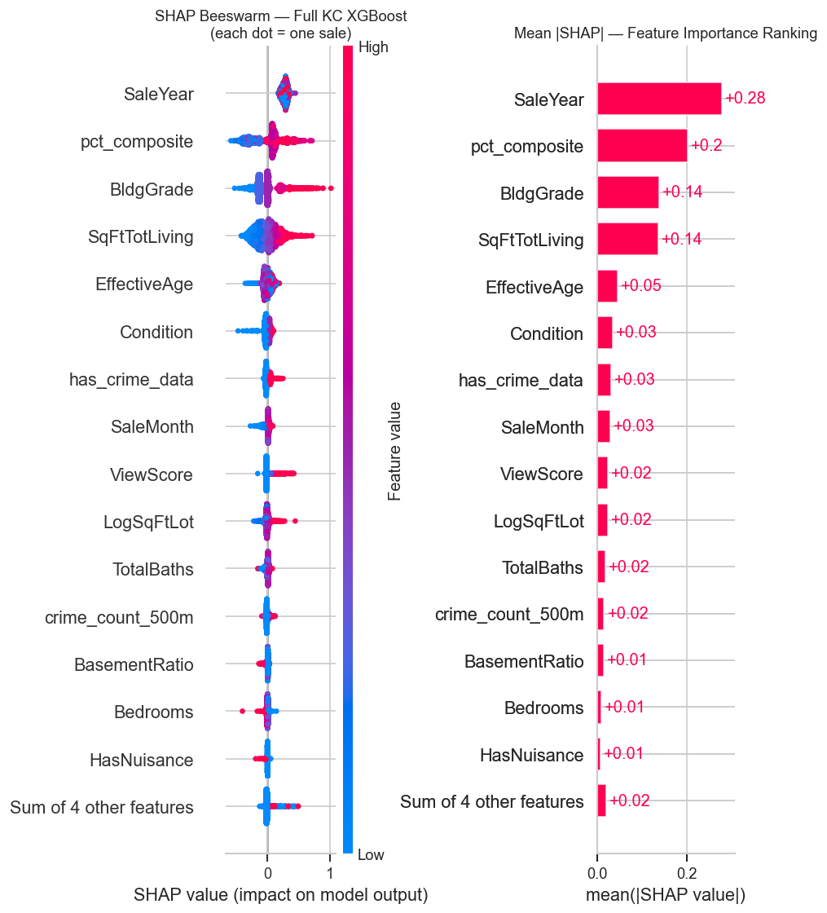

SHAP (SHapley Additive exPlanations) measures how much each feature shifts the model's prediction, for every individual sale. The beeswarm plot (left) shows the direction and magnitude of each feature's effect across all test observations — red dots indicate high feature values, blue indicates low. The bar chart (right) ranks features by mean |SHAP|.

**SaleYear (0.25)** is the dominant feature — the market-wide price level in the year of sale is the single biggest driver, reflecting the strong price trend from 2015 to 2022 and the 2023–2024 correction. **School quality (pct_composite, 0.20)** is the second-largest driver — ahead of building grade (0.14) and living area (0.09). This confirms that school district assignment is a primary pricing signal, not a secondary one. Effective age (0.05) and crime exposure (0.03) follow.

---

**Marginal price effects — school quality and crime**

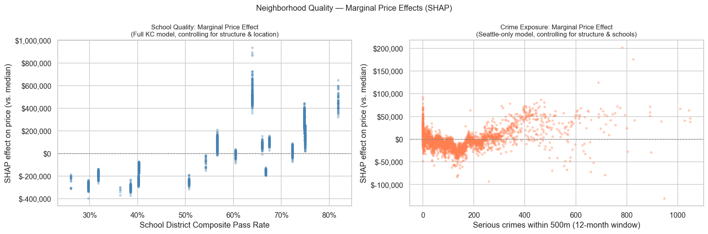

These two panels isolate the marginal effect of school quality and crime on price, with all other features held constant via SHAP.

**School quality (left):** Moving from a 30% composite pass rate to an 80% pass rate is associated with roughly **+$150K–$200K** in predicted price, holding structure and location constant. The relationship is strong and consistent across the full KC dataset — this is not merely a proxy for neighborhood income or home size, since those are already controlled for.

**Crime exposure (right):** For Seattle-only properties, increasing nearby serious crime from near-zero to 1,000 incidents within 500m over the prior 12 months is associated with a median price reduction of roughly **−$50K–$100K**. The effect is real but noisy — the wide scatter reflects that crime exposure correlates with urban density, which carries its own price premium, making the net effect weaker than the raw quintile comparison suggests.

---

**Summary**

The EDA in `data_foundation.md` flagged that raw comparisons — waterfront premiums, school quality gaps, crime quintiles — could not isolate any single factor, because expensive homes tend to be larger, better-graded, and in better locations all at once. The models address this directly by holding all other features constant, and three findings stand out for buyers:

**School quality is real and large, but the raw premium overstates it.** The +99% raw school quality gap narrows once home size and location are controlled — but the SHAP marginal effect still shows a consistent **+$150K–$200K** difference between a low-scoring district (~30% pass rate) and a high-scoring one (~80%), all else equal. This is a genuine pricing signal, not just a proxy for bigger or nicer homes.

**Market timing matters more than any feature of the house itself.** SaleYear is the single dominant predictor (SHAP=0.25, ahead of school quality at 0.20 and building grade at 0.14). A buyer purchasing the same home in 2019 vs. the 2022 peak would have paid roughly $150K–$250K more at the peak. For buyers currently in the market, the 2023–2024 correction has partially unwound that run-up, but prices remain well above pre-COVID levels.

**Crime is a minor factor, not a dealbreaker.** After controlling for urban density, the crime penalty in Seattle is approximately **−$50K–$100K** at the extreme end of exposure — meaningful, but small relative to school quality or market timing. High-crime neighborhoods in Seattle are dense urban areas where land value offsets most of the crime discount. Avoiding crime is unlikely to save a buyer significant money compared to choosing the right district or the right year to buy.
